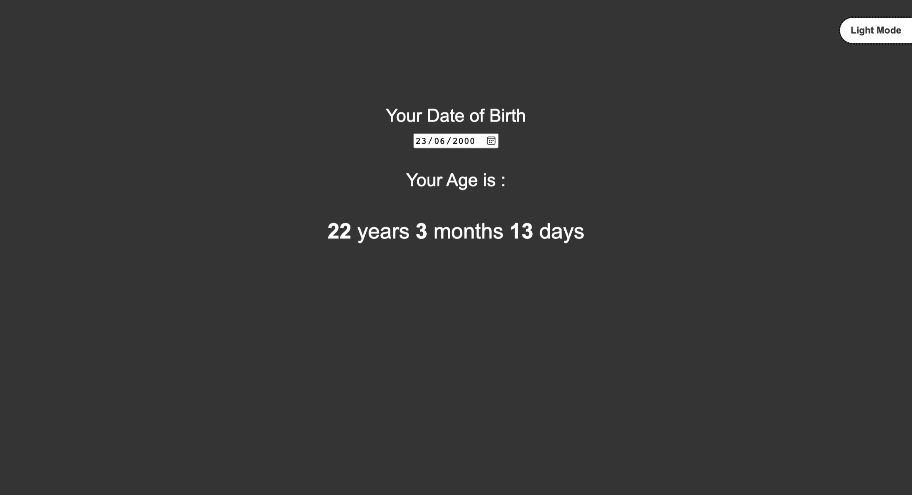

# Age Calculator

- This is a Age Calculator, made using html, css and Javascript

## Screenshot

## Built with

- Semantic HTML5 markup
- CSS custom properties
- Javascript

## What I learned
- DOM Manipulation.
- Usage of Event Listeners("blur").
- All about Date class

## Time taken
- It took me around 60 minutes to built this website from scratch.

## Links
- [live demo]()
- [source]()

## Contact me
- GitHub - [@RAM844](https://github.com/RAM844)
- Twitter - [@ShriramBalaji7](https://www.twitter.com/ShriramBalaji7)